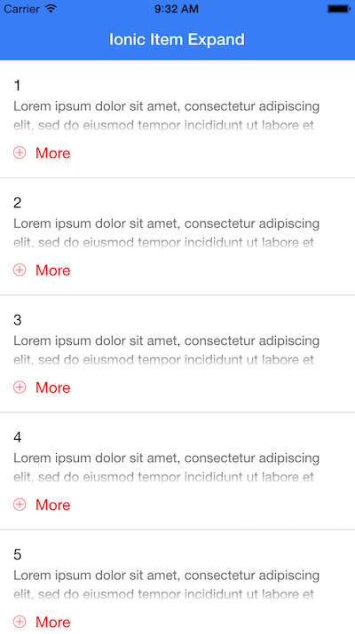

Ionic Item Expand
===================

This is an example of how to implement an expandable ion-list item, triggered by a click event.
The example is templated from the [Ionic Accordion](http://codepen.io/ionic/pen/uJkCz) codepen example.
For a complete out-of-the-box working example, check out the 'demo' link below.

[Demo](http://codepen.io/loringdodge/pen/zGWLQm)

